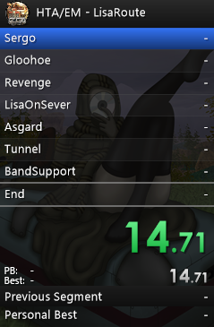

# HTALiveSplit
An autosplitter for speedruns of the original Hard Truck Apocalypse, its other games, as well as any of its mods along with [timer LiveSplit](https://github.com/LiveSplit/LiveSplit).

> [!NOTE]
> 🇷🇺 ***Описание на русском языке [здесь](README.md)***.

<div align="center">
    


</div>

## Features
- Launches a run at the start of a new game;
- Pauses the timer during loading screens;
- Switches splits based on completed quests of a certain category;
- The user can easily change existing and create new category settings for a particular mod.

> [!WARNING]
> *Reads events from the `.log` file of the game, which may cause an inaccurate time.*
> > Anything is better than manually pressing the split button.

## [Video demonstration of the work](https://youtu.be/oVrpQL6um7E)

## Usage
1. Check the file configuration. The `HTALiveSplits` folder contains the available run categories:
```
\HTALiveSplit\
╠═ \HTALiveSplitLOG\
╠═ \HTALiveSplits\
    ╠═ HTALiveSplits_Original_LisaRoute.json
    ╠═ HTALiveSplits_Original_LisaRoute.lss
    ╠═ HTALiveSplits_Original_WithoutLisaRoute.json
    ╠═ HTALiveSplits_Original_WithoutLisaRoute.lss
    ╚═ ...
╠═ HTALiveSplit_Layout_by_E_Jet.lsl
╠═ HTALiveSplit_config.json
╚═ HTALiveSplit.exe
```
2. Make sure that the data is specified correctly in `HTALiveSplit_config.json`:

| Key | Meaning |
|-----------|-----------|
| `GLOBALPATH_EXMACHINA_EXE` | Full path to `.exe` game file, with backslashes `\\` |
| `GLOBALPATH_SPLITS` | Full path to `.json` file of the appropriate run category, with backslashes `\\` |
| `LIVESPLIT_HOST` | The IP-address of the local LiveSplit TCP server for sending HTALiveSplit commands, string. *Do not change it if it is specified by default* |
| `LIVESPLIT_PORT` | The port of the IP-address of the local LiveSplit TCP server for sending HTALiveSplit commands, int. *Do not change it if it is specified by default* |
| `LIVESPLIT_TCP_COMMAND_...` | A set of valid commands for the LiveSplit TCP server to send HTALiveSplit, string. *Change it if your LiveSplit does not respond to current versions of commands* |
| `MATCH_...` | A set of correct events in the `.log` of the game file for HTALiveSplit control, string. *Do not change it if it works correctly* |

**Pause settings:**

| Key | Meaning |
|-----------|-----------|
| `LIVESPLIT_PAUSE_WhenLevelLoading` | The timer is paused when loading the map if `true`. ***`true` by default*** |
| `LIVESPLIT_PAUSE_WhenSaveLoading` | The timer is paused when loading the save if `true`. ***`true` by default*** |
| `LIVESPLIT_PAUSE_WhenGameSaving` | The timer is paused when saving the game if `true`. ***`true` by default*** |


**Reset settings:**

| Key | Meaning |
|-----------|-----------|
| `LIVESPLIT_RESET_WhenGameClosing` | The timer is reset to zero when the game process is crashed/started if `true`. ***`false` by default*** |

3. Launch LiveSplit;

4. Select and specify the desired run category:

| Key | Meaning |
|-----------|-----------|
| `HTALiveSplits_Original_LisaRoute` | The original game run is on a branch with assistance to the Alice at the beginning of the game |
| `HTALiveSplits_Original_WithoutLisaRoute` | The original game run is on a branch with the refusal to help the Alice at the beginning of the game |
| `...` | There can be any of your categories and settings |

- **Settings file** `.json` specify in config HTALiveSplit.
- **Splits file** `.lss` open in LiveSplit.

5. In LiveSplit turn on Game Time for pause work and time display:
   
    5.1. `Right-click on LiveSplit` -> `Compare Against` -> `Game Time`;
   
    5.2. `Right-click on LiveSplit` -> `Edit Layout` -> `Timer`/`Detailed Timer` -> `Timing Method` -> `Game Time`;
   
    5.3. `Right-click on LiveSplit` -> `Edit Layout` -> `Splits` -> All `Columns` blocks -> `Timing Method` -> `Game Time`;

    5.4. `Right-click on LiveSplit` -> `Save Layout As...`;
   
6. In LiveSplit start TCP Server: `Right-click on LiveSplit` -> `Control` -> `Start TCP Server`;

7. Launch `HTALiveSplit.exe` or python-code, monitor its operation by opening the terminal or log. Before the real speedrun, do a small timer test that it is working correctly;

8. Set new records! And report errors❤️

Subsequent launches of HTALiveSplit and LiveSplit do not need to be configured, you only need to run the LiveSplit TCP Server.

## How to edit categories
You can make your own splits for your mod!

1. Open the sample configuration `HTALiveSplits_Original_LisaRoute.json` for HTALiveSplit:

| Key | Meaning |
|-----------|-----------|
| `LOCALPATH_EXMACHINA_MAINMENULEVEL` | The local path inside the game folder (where the `.exe` file is located) to the level ***main menu*** `.ssl` file. The autosplitter will understand when you have entered the main menu |
| `LOCALPATH_EXMACHINA_FIRSTLEVEL` | The local path inside the game folder (where the `.exe` file is located) to the level ***start game*** `.ssl` file. The autosplitter will understand when you have started a new game |
| `SPLIT_QUESTS` | A list of the technical names of the quests of your mod/game. When one of these quests is `is complete` *(or whatever is in its `MATCH`)*, the autosplitter will split the timer segment |
| `SPLIT_LEVELS` | A list of the technical names of the levels of your mod/game *(as in `LOCALPATH_...`)*. When passing to one of these levels for the first time, the autosplitter will split the timer segment |
| `SPLIT_CUSTOM` | A list of any other LOG-lines of your mod/game. When one of these matches is in the log, the autosplitter will split the timer segment |

2. Create your own `.json` file with the necessary settings for your mod. Remember how the story quests go and add the necessary ones to `SPLIT_QUESTS`;

3. In LiveSplit open Splits Editor: `Right-click on LiveSplit` -> `Edit Splits...`;

4. In LiveSplit Split Editor, clear all the segments and add your own, naming them with keywords. Use the buttons on the left. **Important!** The number of quests in `SPLIT_QUESTS` must be equal to or greater than the number of segments in LiveSplit;

5. When you fill it out, click `OK`;

6. Save the resulting segments in the Split Editor LiveSplit: `Right-click on LiveSplit` -> `Save Splits As...`;

7. Test the timer's performance;

8. Compete with others who are interested in your mod!

## Gratitude
- ***Destya*** for feedback and bug detection!
- ***Carsen*** for feedback!

### Used:
- Visual Studio Code
- Python v3.12.4

### Compiled:

[comment]: <> (cd C:\Users\axeble\Desktop\HTALiveSplit)

```powershell
python -m nuitka --onefile HTALiveSplit.py --windows-company-name="E Jet a.k.a. axeble" --windows-product-name="HTALiveSplit" --windows-file-version=1.3 --windows-file-description="Autosplitter HTALiveSplit" --windows-console-mode=force
```
